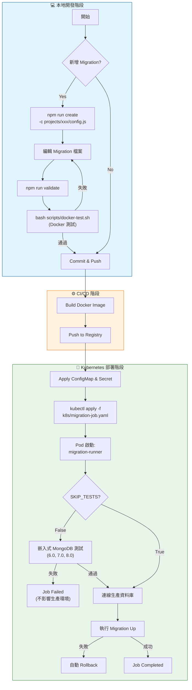

# MongoDB Migration 使用流程

## 🔄 工作流程圖

> 如果無法顯示下方的 Mermaid 圖表，請參考底部的文字版流程圖。



### 📄 文字版流程圖 (Text Version)

```text
+-----------------------------------------------------------------------+
|                        💻 本地開發階段 (Development)                   |
+-----------------------------------------------------------------------+
|                                                                       |
|  [開始] --> <新增 Migration?> -- Yes --> [npm run create]             |
|                  |                          |                         |
|                  No                         v                         |
|                  |                  [編輯 Migration 檔案]             |
|                  |                          |                         |
|                  |                          v                         |
|                  |                  [npm run validate]                |
|                  |                          |                         |
|                  |                          v                         |
|                  |               [bash scripts/docker-test.sh]        |
|                  |                     (Docker 測試)                  |
|                  |                          |                         |
|                  |        (失敗) <----------+----------> (通過)       |
|                  |          |                               |         |
|                  v          +-------------------------------+         |
|            [Commit & Push] <--------------------------------+         |
|                  |                                                    |
+------------------+----------------------------------------------------+
                   |
                   v
+-----------------------------------------------------------------------+
|                        ⚙️ CI/CD 階段                                  |
+-----------------------------------------------------------------------+
|                  |                                                    |
|                  v                                                    |
|         [Build Docker Image] --> [Push to Registry]                   |
|                                       |                               |
+---------------------------------------+-------------------------------+
                                        |
                                        v
+-----------------------------------------------------------------------+
|                        🚀 Kubernetes 部署階段                          |
+-----------------------------------------------------------------------+
|                                       |                               |
|    [Apply ConfigMap & Secret] <-------+                               |
|              |                                                        |
|              v                                                        |
|    [kubectl apply -f k8s/migration-job.yaml]                          |
|              |                                                        |
|              v                                                        |
|    [Pod 啟動: migration-runner]                                       |
|              |                                                        |
|              v                                                        |
|        <SKIP_TESTS?> -- False --> [嵌入式 MongoDB 測試]               |
|              |                        (6.0, 7.0, 8.0)                 |
|              |                               |                        |
|              True                     (失敗) | (通過)                 |
|              |                          |    |                        |
|              |                          v    v                        |
|              +-------------------> [連線生產資料庫]                   |
|                                         |                             |
|                                         v                             |
|                                 [執行 Migration Up]                   |
|                                         |                             |
|                                (失敗) <-+-> (成功)                    |
|                                  |            |                       |
|                                  v            v                       |
|                           [自動 Rollback]   [Job Completed]           |
|                                                                       |
+-----------------------------------------------------------------------+
```

## 📝 常用指令

### 1. 初始化與建立
```bash
# 建立新的 migration 檔案
node src/cli.js create "add-user-fields" -c projects/users/config.js
```

### 2. 驗證與測試
```bash
# 驗證 migration 語法與規則
npm run validate

# 執行完整 Docker 整合測試 (包含 6.0 -> 8.0 升級與 Rollback)
bash scripts/docker-test.sh
```

### 3. 手動執行 (本地開發)
```bash
# 執行特定專案的 migration
node src/cli.js up -c projects/orders/config.js

# 查看狀態
node src/cli.js status -c projects/orders/config.js

# Rollback
node src/cli.js down -c projects/orders/config.js
```

### 4. Kubernetes 部署
```bash
# 部署 Migration Job
kubectl apply -f k8s/migration-job.yaml

# 查看日誌
kubectl logs -f job/mongodb-migration -n mongodb-migrations
```
