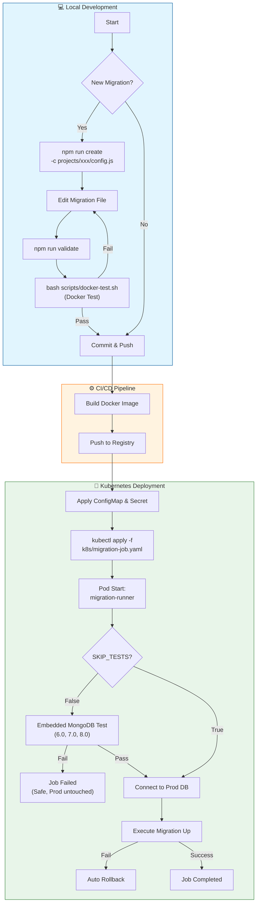

# MongoDB Migration Workflow

## 🔄 Workflow Diagram

> If the Mermaid diagram below does not render, please refer to the text version at the bottom.



### 📄 Text Version

```text
+-----------------------------------------------------------------------+
|                        💻 Local Development                            |
+-----------------------------------------------------------------------+
|                                                                       |
|  [Start] --> <New Migration?> -- Yes --> [npm run create]             |
|                  |                          |                         |
|                  No                         v                         |
|                  |                  [Edit Migration File]             |
|                  |                          |                         |
|                  |                          v                         |
|                  |                  [npm run validate]                |
|                  |                          |                         |
|                  |                          v                         |
|                  |               [bash scripts/docker-test.sh]        |
|                  |                     (Docker Test)                  |
|                  |                          |                         |
|                  |        (Fail) <----------+----------> (Pass)       |
|                  |          |                               |         |
|                  v          +-------------------------------+         |
|            [Commit & Push] <--------------------------------+         |
|                  |                                                    |
+------------------+----------------------------------------------------+
                   |
                   v
+-----------------------------------------------------------------------+
|                        ⚙️ CI/CD Pipeline                               |
+-----------------------------------------------------------------------+
|                  |                                                    |
|                  v                                                    |
|         [Build Docker Image] --> [Push to Registry]                   |
|                                       |                               |
+---------------------------------------+-------------------------------+
                                        |
                                        v
+-----------------------------------------------------------------------+
|                        🚀 Kubernetes Deployment                        |
+-----------------------------------------------------------------------+
|                                       |                               |
|    [Apply ConfigMap & Secret] <-------+                               |
|              |                                                        |
|              v                                                        |
|    [kubectl apply -f k8s/migration-job.yaml]                          |
|              |                                                        |
|              v                                                        |
|    [Pod Start: migration-runner]                                      |
|              |                                                        |
|              v                                                        |
|        <SKIP_TESTS?> -- False --> [Embedded MongoDB Test]             |
|              |                        (6.0, 7.0, 8.0)                 |
|              |                               |                        |
|              True                     (Fail) | (Pass)                 |
|              |                          |    |                        |
|              |                          v    v                        |
|              +-------------------> [Connect to Prod DB]               |
|                                         |                             |
|                                         v                             |
|                                 [Execute Migration Up]                |
|                                         |                             |
|                                (Fail) <-+-> (Success)                 |
|                                  |            |                       |
|                                  v            v                       |
|                           [Auto Rollback]   [Job Completed]           |
|                                                                       |
+-----------------------------------------------------------------------+
```

## 📝 Common Commands

### 1. Initialize & Create
```bash
# Create a new migration file
node src/cli.js create "add-user-fields" -c databases/users/config.js
```

### 2. Validate & Test
```bash
# Validate migration syntax and rules
npm run validate

# Run full Docker integration test (includes 6.0 -> 8.0 upgrade & rollback)
bash scripts/docker-test.sh
```

### 3. Manual Execution (Local)
```bash
# Run migration for a specific project
node src/cli.js up -c databases/orders/config.js

# Check status
node src/cli.js status -c databases/orders/config.js

# Rollback
node src/cli.js down -c databases/orders/config.js
```

### 4. Kubernetes Deployment
```bash
# Deploy Migration Job
kubectl apply -f k8s/migration-job.yaml

# Check logs
kubectl logs -f job/mongodb-migration -n mongodb-migrations
```
