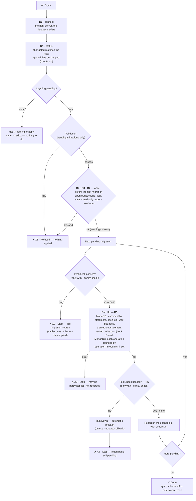

# Execution Flow

What `up` and `sync` do, step by step, for MariaDB and MongoDB DDL migrations: which checks (gates **R0–R6**) run where, and the state the database is left in wherever a run stops. This page is the single place for that flow; the user guides link here.

---

## 1. Flow

**Order in short:** R0 and R1 check the *connection*; validation checks the *files*; R2–R4 check the *moment* just before anything runs; R5 guards *each statement / operation*; R6 checks the *result*. Every migration is recorded as soon as it succeeds, so a later failure doesn't undo earlier ones in the same run.

---

## 2. The gates

| Gate | Checks | MariaDB | MongoDB | When it fails |
|---|---|---|---|---|
| **R0** Connection & identity | The connection reaches the configured server and database, and the database exists | `SELECT DATABASE()` matches the config | `listDatabases` | **Refused**, no override. A missing database is created only with `createDatabaseIfMissing: true` |
| **R1** Changelog consistency | Every recorded migration still has its file, in order; applied files weren't edited since | changelog table + checksum column | changelog collection + checksum | **Refused**. An intentional edit: `--allow-checksum-drift` |
| *Validation* | The pending migrations themselves: forbidden / dangerous operations, syntax, Down present, FK references… | [VALIDATION-RULES-MARIADB.md](VALIDATION-RULES-MARIADB.md) | [VALIDATION-RULES-MONGODB.md](VALIDATION-RULES-MONGODB.md) | **Refused**. Reviewed exceptions: `@allow` in the file or `--allow …` |
| **R2** Open transactions / locks | Something that would make the migration queue and jam the table | Transactions in this database open longer than `runtimeGates.longTransactionSec` (60 s), and sessions already queued on a metadata lock — needs `PROCESS` | Operations / transactions running longer than `longTransactionSec`, via `currentOp` — needs `clusterMonitor` | **Refused**; `--allow-open-transactions` to proceed. Without the privilege the check is **skipped with a warning** — set `runtimeGates.requireLockCheck: true` to refuse instead |
| **R3** Writable target | Not a read-only server or replica | `@@read_only` / `@@innodb_read_only` (checked even when the account could write anyway) | not the writable primary (`hello`); replication lag via `replSetGetStatus` | Read-only: **refused**, no override. MongoDB lag over `replicationLagWarnSec` (30 s): warning |
| **R4** Headroom | Room for what's about to run | binary logs over `binlogWarnMb` (10 GB); an ALTER, index build or bulk UPDATE/DELETE on a table over `largeTableRows` (1,000,000) | disk use over `diskUsageWarnPercent` (90 %); an index build or bulk write on a collection over `largeCollectionDocs` (1,000,000) | **Warning only** |
| **R5** During execution | How long one statement / operation may wait or run | **Lock Guard**, on by default: lock wait ≤ 5 s, a timed-out statement retried on its own, 3 attempts ([LOCK-GUARD.md](LOCK-GUARD.md)); run time: `ddlSafety.statementTimeoutSec` / `-- @statement-timeout-sec:`, **off by default**, the stopped statement rolled back, no retry | `ddlSafety.operationTimeoutMs` / `// @operation-timeout-ms:`, **off by default**; no retry | The migration **stops** and isn't recorded |
| **R6** Result | The migration's PostCheck (only with `--sanity-check`) | `-- +sanity PostCheck` block | exported `postCheck(db, client)` | **Down runs automatically** (unless `--no-auto-rollback`), migration stays pending |

PreCheck (`-- +sanity PreCheck` / exported `preCheck`) isn't a numbered gate: it runs per migration, before its Up, only with `--sanity-check`. Thresholds live under `runtimeGates` in the config. Design and rationale: [RUNTIME-GATE-PLAN.md](RUNTIME-GATE-PLAN.md).

---

## 3. Where a run can stop — and what's left

| Stop | Cause | State afterwards |
|---|---|---|
| **X1** | Validation, or R2–R4 (also R0 / R1, before) | **Nothing ran** in this run |
| **X2** | A migration's PreCheck failed | That migration didn't run; **earlier migrations in the same run are applied and recorded** |
| **X3** | Up failed (error, lock wait exhausted, statement / operation time limit) | That migration **may be partly applied** and isn't recorded — MariaDB commits each DDL statement; a MongoDB multi-document write can stop partway. Recover per [DDL-PRODUCTION-SAFETY.md §7.4](DDL-PRODUCTION-SAFETY.md#74-a-migration-failed-partway-recovering) — **not** with `down` |
| **X4** | PostCheck failed | Down ran; the migration is pending again |

`sync` writes its notification email (`reports/notification.html`) whatever the outcome; with `-o <dir>` it also writes the JSON + HTML report.

---

## 4. Per command

| Command | Differences from the flow above |
|---|---|
| `up` | As drawn. Nothing pending → nothing to do, exit 0; R2–R4 run only when something is pending |
| `up --dry-run` | Runs R0, R1, validation and R2–R4 in **report mode** — shows what would run or be refused, writes nothing |
| `sync` | As drawn. Nothing pending → **exit 1** (before validation). Takes a schema snapshot before running, prints a before/after diff and the current schema after, and writes the notification email in every case |
| `down` | Shows the rollback plan and asks for `yes` (`--yes` outside a terminal); refuses files edited since applied (R1, `--allow-checksum-drift`); runs R2–R4 before rolling back; Down is guarded by Lock Guard (R5) like Up |
| `dcl` / `dcl-all` | Not this flow: repeatable scripts run when their checksum changes. Of the gates: R0, a removed-script check, validation only with `--validate`, and **R3** — no R2 / R4 |
| `k8s/dynamic/` | `run.sh` runs `sync`, then `dcl`, in one Pod — see [k8s/dynamic/README.md](../k8s/dynamic/README.md) |

---

## Related

- [RUNTIME-GATE-PLAN.md](RUNTIME-GATE-PLAN.md) — design of R0–R6, why each is absolute or advisory
- [LOCK-GUARD.md](LOCK-GUARD.md) — R5 on MariaDB
- [DDL-PRODUCTION-SAFETY.md](DDL-PRODUCTION-SAFETY.md) — production checklist; §7.4 recovering from a failed migration
- [USER-GUIDE-MARIADB.md](USER-GUIDE-MARIADB.md) / [USER-GUIDE-MONGODB.md](USER-GUIDE-MONGODB.md) — writing migrations, PreCheck / PostCheck syntax
