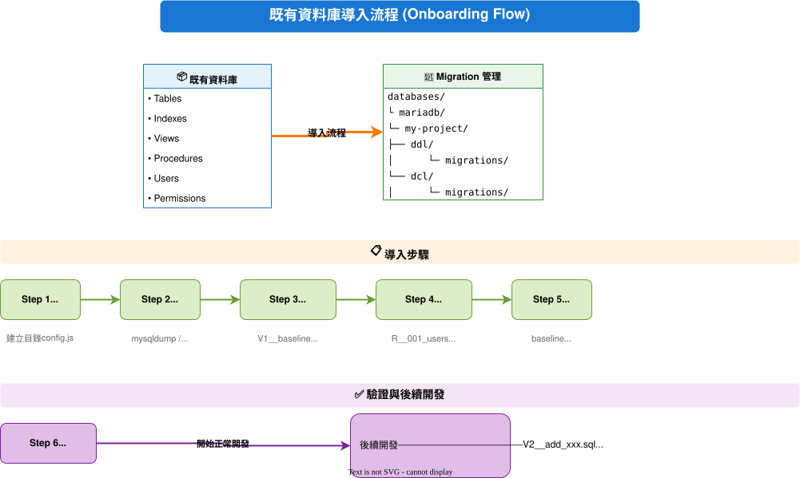

# Existing Database Onboarding SOP

This document explains how to onboard an **existing database** (one that already has a schema and data) into the ddl-migrate tool for management.

---

## Table of Contents

1. [Onboarding Flow Overview](#1-onboarding-flow-overview)
2. [Step 1: Environment Setup](#2-step-1-environment-setup)
3. [Step 2: Export Existing Schema](#3-step-2-export-existing-schema)
4. [Step 3: Create Baseline Migration](#4-step-3-create-baseline-migration)
5. [Step 4: Create DCL (Users/Permissions)](#5-step-4-create-dcl-userspermissions)
6. [Step 5: Run Baseline](#6-step-5-run-baseline)
7. [Step 6: Validate Onboarding Results](#7-step-6-validate-onboarding-results)
8. [Subsequent Development Workflow](#8-subsequent-development-workflow)
9. [FAQ](#9-faq)

---

## 1. Onboarding Flow Overview



> 💡 **Tip**: This diagram can be edited directly using VS Code's [Draw.io Integration](https://marketplace.visualstudio.com/items?itemName=hediet.vscode-drawio) extension.

---

## 2. Step 1: Environment Setup

### 2.1 Create Project Directory Structure

```bash
# MariaDB project structure
mkdir -p test-fixtures/mariadb/my-project/{ddl,dcl}/migrations

# Or MongoDB project structure
mkdir -p test-fixtures/mongodb/my-project/{ddl,dcl}/migrations
```

### 2.2 Create DDL config.js

**MariaDB (`test-fixtures/mariadb/my-project/ddl/config.js`):**

```javascript
export default {
  type: 'mariadb',
  mariadb: {
    host: process.env.MARIADB_HOST || 'localhost',
    port: parseInt(process.env.MARIADB_PORT || '3306'),
    user: process.env.MARIADB_USER || 'root',
    password: process.env.MARIADB_PASSWORD || 'password',
    database: process.env.MARIADB_DATABASE || 'my_database',
    multipleStatements: true
  },
  migrationsDir: './migrations',
  changelogTable: '_migrations'
};
```

**MongoDB (`test-fixtures/mongodb/my-project/ddl/config.js`):**

```javascript
export default {
  type: 'mongodb',
  mongodb: {
    url: process.env.MONGODB_URI || 'mongodb://localhost:27017',
    databaseName: process.env.MONGODB_DB || 'my_database',
    options: {}
  },
  migrationsDir: './migrations',
  changelogCollection: 'changelog'
};
```

### 2.3 Create DCL config.js

**MariaDB (`test-fixtures/mariadb/my-project/dcl/config.js`):**

```javascript
export default {
  type: 'mariadb',
  mode: 'repeatable',   // required — without this, DCL statements (CREATE USER/GRANT) are
                         // validated under DDL-mode rules and need --allow-forbidden instead
  mariadb: {
    host: process.env.MARIADB_HOST || 'localhost',
    port: parseInt(process.env.MARIADB_PORT || '3306'),
    user: process.env.MARIADB_USER || 'root',
    password: process.env.MARIADB_PASSWORD || 'password',
    database: process.env.MARIADB_DATABASE || 'my_database',
    multipleStatements: true
  },
  migrationsDir: './migrations',
  checksumTable: '_dcl_migrations'
};
```

---

## 3. Step 2: Export Existing Schema

### 3.1 MariaDB Schema Export

```bash
# Export schema (no data)
mysqldump -h localhost -u root -p \
  --no-data \
  --routines \
  --triggers \
  --skip-comments \
  my_database > schema-export.sql

# Export only specific tables
mysqldump -h localhost -u root -p \
  --no-data \
  my_database users products orders > schema-export.sql

# Export users and permissions
mysql -h localhost -u root -p -N -e "
  SELECT CONCAT('-- User: ', user, '@', host) AS comment,
         CONCAT('CREATE USER IF NOT EXISTS ''', user, '''@''', host, ''' IDENTIFIED BY ''password'';') AS create_stmt
  FROM mysql.user 
  WHERE user NOT IN ('root', 'mysql.sys', 'mysql.session', 'mysql.infoschema', 'mariadb.sys')
" > users-export.sql

mysql -h localhost -u root -p -N -e "
  SHOW GRANTS FOR 'app_user'@'%';
" >> users-export.sql
```

### 3.2 MongoDB Schema Export

```bash
# Export indexes and validators for all collections
mongosh my_database --eval '
  db.getCollectionNames().forEach(function(coll) {
    print("// Collection: " + coll);
    
    // Indexes
    var indexes = db.getCollection(coll).getIndexes();
    indexes.forEach(function(idx) {
      if (idx.name !== "_id_") {
        print("db." + coll + ".createIndex(" + JSON.stringify(idx.key) + ", " + 
              JSON.stringify({name: idx.name, unique: idx.unique || false}) + ");");
      }
    });
    
    // Validation
    var info = db.getCollectionInfos({name: coll})[0];
    if (info && info.options && info.options.validator) {
      print("// Validator: " + JSON.stringify(info.options.validator));
    }
    print("");
  });
' > schema-export.js
```

### 3.3 Export Using Docker

```bash
# MariaDB (Docker Compose)
docker compose exec mariadb mysqldump \
  -u root -prootpass \
  --no-data \
  --routines \
  my_database > schema-export.sql

# MongoDB (Docker Compose)
docker compose exec mongodb mongosh my_database --eval '...' > schema-export.js
```

---

## 4. Step 3: Create Baseline Migration

### 4.1 MariaDB Baseline

**File: `test-fixtures/mariadb/my-project/ddl/migrations/20250101000000-baseline.sql`**

```sql
-- +migrate Up
-- ═══════════════════════════════════════════════════════════════
-- Baseline Migration - Initialize existing schema
-- Created: 2025-01-26
-- Description: This file captures the existing schema at onboarding time.
--       It is not actually executed; it only records the baseline state.
-- ═══════════════════════════════════════════════════════════════

-- ─────────────────────────────────────────────────────────────────
-- Table: users
-- ─────────────────────────────────────────────────────────────────
CREATE TABLE IF NOT EXISTS users (
    id BIGINT UNSIGNED AUTO_INCREMENT PRIMARY KEY,
    username VARCHAR(50) NOT NULL,
    email VARCHAR(100) NOT NULL,
    password_hash VARCHAR(255) NOT NULL,
    status ENUM('active', 'inactive', 'suspended') DEFAULT 'active',
    created_at TIMESTAMP DEFAULT CURRENT_TIMESTAMP,
    updated_at TIMESTAMP DEFAULT CURRENT_TIMESTAMP ON UPDATE CURRENT_TIMESTAMP,
    
    UNIQUE KEY uk_username (username),
    UNIQUE KEY uk_email (email),
    INDEX idx_status (status),
    INDEX idx_created_at (created_at)
) ENGINE=InnoDB DEFAULT CHARSET=utf8mb4 COLLATE=utf8mb4_unicode_ci;

-- ─────────────────────────────────────────────────────────────────
-- Table: products
-- ─────────────────────────────────────────────────────────────────
CREATE TABLE IF NOT EXISTS products (
    id BIGINT UNSIGNED AUTO_INCREMENT PRIMARY KEY,
    name VARCHAR(200) NOT NULL,
    description TEXT,
    price DECIMAL(10, 2) NOT NULL,
    stock INT UNSIGNED DEFAULT 0,
    category_id BIGINT UNSIGNED,
    created_at TIMESTAMP DEFAULT CURRENT_TIMESTAMP,
    
    INDEX idx_category (category_id),
    INDEX idx_price (price)
) ENGINE=InnoDB DEFAULT CHARSET=utf8mb4 COLLATE=utf8mb4_unicode_ci;

-- ─────────────────────────────────────────────────────────────────
-- Table: orders
-- ─────────────────────────────────────────────────────────────────
CREATE TABLE IF NOT EXISTS orders (
    id BIGINT UNSIGNED AUTO_INCREMENT PRIMARY KEY,
    user_id BIGINT UNSIGNED NOT NULL,
    total_amount DECIMAL(10, 2) NOT NULL,
    status ENUM('pending', 'paid', 'shipped', 'completed', 'cancelled') DEFAULT 'pending',
    created_at TIMESTAMP DEFAULT CURRENT_TIMESTAMP,
    
    FOREIGN KEY (user_id) REFERENCES users(id) ON DELETE CASCADE,
    INDEX idx_user_id (user_id),
    INDEX idx_status (status),
    INDEX idx_created_at (created_at)
) ENGINE=InnoDB DEFAULT CHARSET=utf8mb4 COLLATE=utf8mb4_unicode_ci;

-- ─────────────────────────────────────────────────────────────────
-- Stored Procedures (if any)
-- ─────────────────────────────────────────────────────────────────
DELIMITER //

CREATE PROCEDURE IF NOT EXISTS sp_get_user_orders(IN p_user_id BIGINT)
BEGIN
    SELECT o.*, u.username
    FROM orders o
    JOIN users u ON o.user_id = u.id
    WHERE o.user_id = p_user_id
    ORDER BY o.created_at DESC;
END //

DELIMITER ;

-- +migrate Down
-- ⚠️ Baseline does not support Down (this would delete all data)
-- To restore, use a database backup

DROP PROCEDURE IF EXISTS sp_get_user_orders;
DROP TABLE IF EXISTS orders;
DROP TABLE IF EXISTS products;
DROP TABLE IF EXISTS users;
```

### 4.2 MongoDB Baseline

**File: `test-fixtures/mongodb/my-project/ddl/migrations/20250101000000-baseline.js`**

```javascript
/**
 * Baseline Migration - Initialize existing schema
 * Created: 2025-01-26
 * Description: This file captures the existing schema at onboarding time.
 *       It is not actually executed; it only records the baseline state.
 */

export async function up(db, client) {
  // ═══════════════════════════════════════════════════════════════
  // Collection: users
  // ═══════════════════════════════════════════════════════════════
  const collections = await db.listCollections({ name: 'users' }).toArray();
  if (collections.length === 0) {
    await db.createCollection('users', {
      validator: {
        $jsonSchema: {
          bsonType: 'object',
          required: ['username', 'email'],
          properties: {
            username: { bsonType: 'string', minLength: 1 },
            email: { bsonType: 'string', pattern: '^.+@.+$' },
            status: { enum: ['active', 'inactive', 'suspended'] }
          }
        }
      }
    });
  }
  
  // Indexes for users
  await db.collection('users').createIndex({ username: 1 }, { unique: true, name: 'uk_username' });
  await db.collection('users').createIndex({ email: 1 }, { unique: true, name: 'uk_email' });
  await db.collection('users').createIndex({ status: 1 }, { name: 'idx_status' });
  await db.collection('users').createIndex({ createdAt: 1 }, { name: 'idx_createdAt' });

  // ═══════════════════════════════════════════════════════════════
  // Collection: products
  // ═══════════════════════════════════════════════════════════════
  const productsExists = await db.listCollections({ name: 'products' }).toArray();
  if (productsExists.length === 0) {
    await db.createCollection('products');
  }
  
  await db.collection('products').createIndex({ categoryId: 1 }, { name: 'idx_category' });
  await db.collection('products').createIndex({ price: 1 }, { name: 'idx_price' });

  // ═══════════════════════════════════════════════════════════════
  // Collection: orders
  // ═══════════════════════════════════════════════════════════════
  const ordersExists = await db.listCollections({ name: 'orders' }).toArray();
  if (ordersExists.length === 0) {
    await db.createCollection('orders');
  }
  
  await db.collection('orders').createIndex({ userId: 1 }, { name: 'idx_userId' });
  await db.collection('orders').createIndex({ status: 1 }, { name: 'idx_status' });
  await db.collection('orders').createIndex({ createdAt: 1 }, { name: 'idx_createdAt' });
}

export async function down(db, client) {
  // ⚠️ Running Down on a baseline is not recommended (this would delete all data)
  // To restore, use a database backup
  
  await db.collection('orders').drop().catch(() => {});
  await db.collection('products').drop().catch(() => {});
  await db.collection('users').drop().catch(() => {});
}
```

---

## 5. Step 4: Create DCL (Users/Permissions)

### 5.1 MariaDB DCL

**File: `test-fixtures/mariadb/my-project/dcl/migrations/R__001_app_users.sql`**

```sql
-- ═══════════════════════════════════════════════════════════════
-- DCL: Application Users
-- Description: Database account used by the application
-- ═══════════════════════════════════════════════════════════════
-- @allow-dangerous: true
-- @description: Create application account

-- Application account (read/write)
CREATE USER IF NOT EXISTS 'app_user'@'%' IDENTIFIED BY 'app_password_here';

-- Grant permissions
GRANT SELECT, INSERT, UPDATE, DELETE ON my_database.* TO 'app_user'@'%';

-- Stored procedure execution permission (if any)
GRANT EXECUTE ON my_database.* TO 'app_user'@'%';

FLUSH PRIVILEGES;
```

**File: `test-fixtures/mariadb/my-project/dcl/migrations/R__002_readonly_users.sql`**

```sql
-- ═══════════════════════════════════════════════════════════════
-- DCL: Read-only Users
-- Description: Read-only account for reporting or analytics
-- ═══════════════════════════════════════════════════════════════
-- @allow-dangerous: true
-- @description: Create read-only account

-- Read-only account
CREATE USER IF NOT EXISTS 'readonly_user'@'%' IDENTIFIED BY 'readonly_password_here';

-- Grant SELECT only
GRANT SELECT ON my_database.* TO 'readonly_user'@'%';

FLUSH PRIVILEGES;
```

### 5.2 MongoDB DCL

**File: `test-fixtures/mongodb/my-project/dcl/migrations/R__001_app_users.js`**

```javascript
/**
 * DCL: Application Users
 * Description: Database account used by the application
 * @allow-dangerous: true
 */

export async function up(db, client) {
  const adminDb = client.db('admin');
  
  // Create application account (read/write)
  try {
    await adminDb.command({
      createUser: 'app_user',
      pwd: 'app_password_here',
      roles: [
        { role: 'readWrite', db: 'my_database' }
      ]
    });
  } catch (error) {
    if (error.code !== 51003) { // User already exists
      throw error;
    }
    // Update existing user
    await adminDb.command({
      updateUser: 'app_user',
      pwd: 'app_password_here',
      roles: [
        { role: 'readWrite', db: 'my_database' }
      ]
    });
  }
}

export async function down(db, client) {
  const adminDb = client.db('admin');
  try {
    await adminDb.command({ dropUser: 'app_user' });
  } catch (error) {
    // Ignore if user doesn't exist
  }
}
```

---

## 6. Step 5: Run Baseline

### 6.1 Use the baseline Command (Recommended)

```bash
# View which migration files exist
docker compose run --rm migrate baseline -c /app/test-fixtures/mariadb/my-project/ddl/config.js

# Mark all DDL as applied (without actually executing the SQL)
docker compose run --rm migrate baseline --all -c /app/test-fixtures/mariadb/my-project/ddl/config.js

# Mark only up to a specific version
docker compose run --rm migrate baseline --up-to 20250101000000-baseline -c /app/test-fixtures/mariadb/my-project/ddl/config.js

# Preview (without actually marking)
docker compose run --rm migrate baseline --all --dry-run -c /app/test-fixtures/mariadb/my-project/ddl/config.js
```

### 6.2 First-time DCL Execution

```bash
# DCL must actually be executed (to create users/permissions)
docker compose run --rm migrate dcl --validate --allow-dangerous -c /app/test-fixtures/mariadb/my-project/dcl/config.js
```

### 6.3 Full Onboarding Script

```bash
#!/bin/bash
# onboard-existing-db.sh
# Existing database onboarding script

set -e

PROJECT=${1:-my-project}
DB_TYPE=${2:-mariadb}

echo "═══════════════════════════════════════════════════════════"
echo "  Onboarding Existing Database: ${PROJECT}"
echo "  Database Type: ${DB_TYPE}"
echo "═══════════════════════════════════════════════════════════"

DDL_CONFIG="/app/test-fixtures/${DB_TYPE}/${PROJECT}/ddl/config.js"
DCL_CONFIG="/app/test-fixtures/${DB_TYPE}/${PROJECT}/dcl/config.js"

# Step 1: Confirm database connection
echo ""
echo "Step 1: Confirm database connection..."
docker compose run --rm migrate status -c $DDL_CONFIG

# Step 2: Mark DDL baseline
echo ""
echo "Step 2: Mark DDL baseline..."
docker compose run --rm migrate baseline --all -c $DDL_CONFIG

# Step 3: Validate DDL status
echo ""
echo "Step 3: Validate DDL status..."
docker compose run --rm migrate status -c $DDL_CONFIG

# Step 4: Run DCL (create accounts)
echo ""
echo "Step 4: Run DCL..."
docker compose run --rm migrate dcl --validate --allow-dangerous -c $DCL_CONFIG

# Step 5: Validate DCL status
echo ""
echo "Step 5: Validate DCL status..."
docker compose run --rm migrate dcl:status -c $DCL_CONFIG

echo ""
echo "═══════════════════════════════════════════════════════════"
echo "  ✅ Onboarding complete!"
echo "═══════════════════════════════════════════════════════════"
echo ""
echo "For subsequent development, use:"
echo "  # Create a new DDL migration"
echo "  docker compose run --rm migrate create 'add-xxx-table' -c $DDL_CONFIG"
echo ""
echo "  # Run migration"
echo "  docker compose run --rm migrate up -c $DDL_CONFIG"
```

---

## 7. Step 6: Validate Onboarding Results

### 7.1 Check DDL Status

```bash
docker compose run --rm migrate status -c /app/test-fixtures/mariadb/my-project/ddl/config.js
```

**Expected output:**
```
[STATUS] Database: mariadb
──────────────────────────────────────────────────

✅ Applied (1):
   20250101000000-baseline.sql - Mon Jan 26 2026 10:00:00 GMT+0000

⏳ Pending (0):
   (none)
```

### 7.2 Check DCL Status

```bash
docker compose run --rm migrate dcl:status -c /app/test-fixtures/mariadb/my-project/dcl/config.js
```

### 7.3 Validate Database Accounts

```bash
# MariaDB - check users
docker compose exec mariadb mariadb -u root -prootpass -e "SELECT user, host FROM mysql.user WHERE user LIKE 'app%' OR user LIKE 'readonly%';"

# MongoDB - check users
docker compose exec mongodb mongosh admin --eval "db.getUsers()"
```

---

## 8. Subsequent Development Workflow

After onboarding is complete, the subsequent development workflow is as follows:

### 8.1 Create a New DDL Migration

```bash
# Create a new migration file
docker compose run --rm migrate create 'add-user-profile-table' -c /app/test-fixtures/mariadb/my-project/ddl/config.js

# Edit file: 20250126100000-add-user-profile-table.sql
```

### 8.2 Run Migration

```bash
# Preview
docker compose run --rm migrate up --dry-run -c /app/test-fixtures/mariadb/my-project/ddl/config.js

# Run
docker compose run --rm migrate up -c /app/test-fixtures/mariadb/my-project/ddl/config.js
```

### 8.3 Add DCL

```bash
# Create a new DCL file
docker compose run --rm migrate create-dcl 'new-service-account' -n 003 -c /app/test-fixtures/mariadb/my-project/dcl/config.js

# Run
docker compose run --rm migrate dcl --validate --allow-dangerous -c /app/test-fixtures/mariadb/my-project/dcl/config.js
```

---

## 9. FAQ

### Q1: Does Baseline Execute SQL?

**A:** No. The `baseline` command only records in the changelog table that the migration has been applied; it does not actually execute the SQL content. This is because the existing database already has this schema.

### Q2: What If the Baseline File's Schema Doesn't Match Reality?

**A:** The baseline file is mainly used to record "this is the starting state." Even if it differs slightly from the actual schema, it does not affect subsequent incremental migrations. However, it is recommended to keep it as consistent as possible for future reference.

### Q3: Can There Be Multiple Baseline Files?

**A:** Yes, but it's not recommended. Usually one baseline file is enough. If the schema is too large, you can split it into multiple files:
- `20250101000001-baseline-users.sql`
- `20250101000002-baseline-products.sql`
- `20250101000003-baseline-orders.sql`

### Q4: Does DCL Need a Baseline?

**A:** DCL uses the Repeatable (R__) format and doesn't need a baseline. It is reapplied every time it runs (idempotent), so you just need to create the correct DCL file and run it.

### Q5: How to Handle Multiple Environments (DEV/STG/PROD)?

**A:** 
1. Use the same migration files across every environment
2. Switch the database connection via environment variables
3. Test in DEV first, then promote to STG/PROD

```bash
# DEV
MARIADB_HOST=dev-db.example.com ./scripts/onboard-existing-db.sh

# PROD
MARIADB_HOST=prod-db.example.com ./scripts/onboard-existing-db.sh
```

### Q6: What If a Table Was Missed During Onboarding?

**A:** Create a new migration to add it:

```bash
# Create a supplementary migration
docker compose run --rm migrate create 'add-missing-audit-table' -c /app/test-fixtures/mariadb/my-project/ddl/config.js
```

### Q7: How to Roll Back to Before the Baseline?

**A:** This is not recommended. If truly necessary:
1. Restore from a database backup
2. Clear the changelog table
3. Re-run baseline

---

## Quick Reference Card

```bash
# ═══════════════════════════════════════════════════════════════
# Existing Database Onboarding - Quick Commands
# ═══════════════════════════════════════════════════════════════

# 1. Create directories
mkdir -p test-fixtures/mariadb/my-project/{ddl,dcl}/migrations

# 2. Create config.js (there is no ready-made _templates directory —
#    just copy a real example and edit it; remember to add
#    mode: 'repeatable' for DCL, see section 2.3 above)
cp test-fixtures/mariadb/test-success/ddl/config.js test-fixtures/mariadb/my-project/ddl/
cp test-fixtures/mariadb/test-success/dcl/config.js test-fixtures/mariadb/my-project/dcl/

# 3. Export the existing schema and create a baseline file
# ... (manual editing)

# 4. Mark baseline
docker compose run --rm migrate baseline --all \
  -c /app/test-fixtures/mariadb/my-project/ddl/config.js

# 5. Run DCL
docker compose run --rm migrate dcl --validate --allow-dangerous \
  -c /app/test-fixtures/mariadb/my-project/dcl/config.js

# 6. Validate
docker compose run --rm migrate status \
  -c /app/test-fixtures/mariadb/my-project/ddl/config.js

# Next: create a new migration
docker compose run --rm migrate create 'add-xxx' \
  -c /app/test-fixtures/mariadb/my-project/ddl/config.js
```
