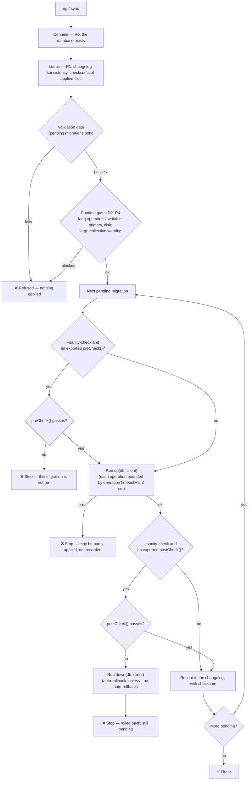

# MongoDB DDL/DCL Migration Guide

> **Verified against the source on 2026-10-02.** Every complete example below passes `validate`; the sanity-check and DCL patterns follow the repository's templates. The full rule list lives in [VALIDATION-RULES-MONGODB.md](./VALIDATION-RULES-MONGODB.md).
>
> `up`/`sync` validate pending files before running them and refuse on failure; `R__` files in a DDL directory are ignored. Rules can be tuned per project — see [VALIDATION-RULES-REFERENCE.md](./VALIDATION-RULES-REFERENCE.md#project-policy-turning-rules-off-down-or-up-and-adding-your-own).

---

## 📋 Table of Contents

1. [File Types](#1-file-types)
2. [Versioned vs Repeatable Syntax Comparison](#2-versioned-vs-repeatable-syntax-comparison)
3. [Migration File Structure](#3-migration-file-structure)
4. [Dangerous Command List](#4-dangerous-command-list)
5. [How to Allow Dangerous Commands](#5-how-to-allow-dangerous-commands)
6. [Sanity Check Mechanism](#6-sanity-check-mechanism)
7. [Docker Environment Setup and CLI Usage](#7-docker-environment-setup-and-cli-usage)
8. [Scenario Examples](#8-scenario-examples)

---

## 1. File Types

### DDL (Versioned Migration)
- **Purpose**: Schema changes (creating collections, indexes, validation)
- **File name format**: `YYYYMMDDHHMMSS-description.js`
- **Characteristics**: Each file runs exactly once, in version order
- **Example**: `20250101000001-create-users.js`

### DCL (Repeatable Migration)
- **Purpose**: Permission management (users, roles, grants)
- **File name format**: `R__<name>.js` — by convention `R__NNN_description.js`; files run in file-name order
- **Characteristics**: Re-run whenever the checksum changes; must be idempotent
- **Lives in**: a separate project with `mode: 'repeatable'` in its config (see [§7.2](#72-local-environment-setup))
- **Example**: `R__001_create_app_user.js`

---

## 2. Versioned vs Repeatable Syntax Comparison

### 📁 Versioned (DDL) - One-time Execution

| Operation Type | Syntax Example | Notes |
|---------|---------|------|
| Create collection | `db.createCollection('users')` | ✅ Standard usage |
| Create index | `db.collection('users').createIndex({email: 1})` | ✅ Standard usage |
| Create unique index | `createIndex({email: 1}, {unique: true})` | ✅ Standard usage |
| Create compound index | `createIndex({status: 1, createdAt: -1})` | ✅ Standard usage |
| Set schema validation | `db.command({collMod: ...})` | ✅ Standard usage |
| Drop collection | `db.collection('xxx').drop()` | ⚠️ Needs a matching down() |
| Drop index | `db.collection('xxx').dropIndex()` | ⚠️ Dangerous operation |
| Insert seed data | `db.collection('xxx').insertMany()` | ✅ Standard usage |

**File structure:**
```javascript
export async function up(db, client) {
  await db.createCollection('users');
  await db.collection('users').createIndex(
    { email: 1 },
    { unique: true, name: 'idx_users_email' }
  );
}

export async function down(db, client) {
  await db.collection('users').drop();
}
```

### 📁 Repeatable (DCL) - Repeatable Execution

| Operation Type | Syntax Example | Notes |
|---------|---------|------|
| Create user | `adminDb.command({ createUser, pwd: 'CHANGE_ME_ON_FIRST_LOGIN', … })` | ✅ Check `usersInfo` first; the placeholder gets a generated password |
| Create role | `adminDb.command({ createRole: … })` | ✅ Check `rolesInfo` first |
| Update role | `adminDb.command({ updateRole: … })` | ✅ Naturally idempotent |
| Grant role | `adminDb.command({ grantRolesToUser: … })` | ✅ Naturally idempotent |
| Revoke role | `adminDb.command({ revokeRolesFromUser: … })` | ✅ Naturally idempotent |
| Update user | `adminDb.command({ updateUser: … })` | 🔴 `UPDATE_USER_CMD` — needs `// @allow-forbidden: true` |
| Drop user | `adminDb.command({ dropUser: … })` | 🔴 `DROP_USER_CMD` — needs `// @allow-forbidden: true` |
| Collections, indexes | `createCollection`, `createIndex`, `renameCollection` | ⛔ Never allowed in DCL (`*_IN_DCL`, can't be overridden) — put them in the DDL project |

**File structure** (same as [`templates/mongodb/dcl/TEMPLATE-create-user-readonly.js`](../templates/mongodb/dcl/TEMPLATE-create-user-readonly.js)):
```javascript
// @allow-forbidden: true
// (updateUser in the "already exists" branch is high-risk by default)

export async function up(db, client) {
  const adminDb = client.db('admin');
  const username = 'app_readonly';

  const existing = await adminDb.command({ usersInfo: username });
  if (existing.users.length === 0) {
    await adminDb.command({
      createUser: username,
      pwd: 'CHANGE_ME_ON_FIRST_LOGIN',
      roles: [{ role: 'read', db: 'mydb' }]
    });
    return { passwordSet: true, createdUsernames: [username], allUsernames: [username] };
  }

  await adminDb.command({ updateUser: username, roles: [{ role: 'read', db: 'mydb' }] });
  return { passwordSet: false, allUsernames: [username] };
}
```

The return value tells the runner what happened, for the notification email: `passwordSet: true` (new account), `false` (already existed, password unchanged) or `'rotated'` (password reset). DCL files don't need a `down()` — they're never rolled back.

---

## 3. Migration File Structure

### 3.1 Full File Structure Diagram

#### MongoDB Migration File Structure (.js)

| Export | Required | Runs |
|---|---|---|
| `up(db, client)` | ✅ | Always — the migration itself |
| `down(db, client)` | ✅ when `up()` changes anything (`MISSING_DOWN`) | `down` command; auto-rollback after a failed `postCheck` |
| `preCheck(db, client)` | Optional | Only with `--sanity-check`, before `up()`. A failure stops the run; `up()` doesn't execute |
| `postCheck(db, client)` | Optional | Only with `--sanity-check`, after `up()`. A failure runs `down()` (unless `--no-auto-rollback`) and stops the run |

`db` is the configured database; `client` is the `MongoClient`, e.g. `client.db('admin')`. With `ddlSafety.operationTimeoutMs` (or `// @operation-timeout-ms:`) set, every operation issued through either is time-limited.

`preCheck` / `postCheck` must **return** `{ success: true, details?: [...] }` or `{ success: false, error: '…' }`; a thrown error also counts as a failure. Each has `sanityCheck.timeoutMs` (default 30 s).

> A check written *inside* `up()` that throws is not a sanity check: it just makes `up()` fail, the migration stays pending, and **nothing rolls back** what `up()` already did. Use the exported functions when you want automatic rollback.

#### Full Example Structure

```javascript
// annotations (optional) go in the leading comment block — see §5

export async function preCheck(db, client) {
  const exists = await db.listCollections({ name: 'users' }).toArray();
  return exists.length > 0
    ? { success: true }
    : { success: false, error: 'users collection not found — run the create-users migration first' };
}

export async function up(db, client) {
  await db.createCollection('orders');
  await db.collection('orders').createIndex({ userId: 1 }, { name: 'idx_orders_user' });
}

export async function postCheck(db, client) {
  const indexes = await db.collection('orders').indexes();
  return indexes.some(i => i.name === 'idx_orders_user')
    ? { success: true }
    : { success: false, error: 'idx_orders_user was not created' };
}

export async function down(db, client) {
  await db.collection('orders').drop();
}
```

### 3.2 Section Descriptions

| Block | Syntax | Required | Purpose |
|------|------|--------|------|
| **up()** | `export async function up(db, client)` | ✅ Required | Defines the "forward migration" logic |
| **down()** | `export async function down(db, client)` | ✅ Required when up() changes anything | Defines the "rollback" logic |
| **preCheck()** | `export async function preCheck(db, client)` | ❌ Optional | State check before execution — only with `--sanity-check` |
| **postCheck()** | `export async function postCheck(db, client)` | ❌ Optional | Result validation after execution — only with `--sanity-check`; a failure runs down() |

### 3.3 Execution Flow



Automatic rollback applies to the exported `preCheck(db, client)` / `postCheck(db, client)` functions run by `--sanity-check` (see [`templates/mongodb/ddl/TEMPLATE-with-sanity-check.js`](../templates/mongodb/ddl/TEMPLATE-with-sanity-check.js)). A check written inside `up()` that throws only fails the migration — nothing rolls back what `up()` already did. `--dry-run` stops after the gates. Details: [RUNTIME-GATE-PLAN.md](RUNTIME-GATE-PLAN.md).

### 3.4 Basic Example (up/down only)

```javascript
export async function up(db, client) {
  // Create the collection
  await db.createCollection('users');
  
  // Create indexes
  await db.collection('users').createIndex(
    { email: 1 },
    { unique: true, name: 'uk_users_email' }
  );
  
  await db.collection('users').createIndex(
    { createdAt: -1 },
    { name: 'idx_users_createdAt' }
  );
}

export async function down(db, client) {
  await db.collection('users').drop();
}
```

### 3.5 Full Example (with preCheck/postCheck)

Same as [`templates/mongodb/ddl/TEMPLATE-with-sanity-check.js`](../templates/mongodb/ddl/TEMPLATE-with-sanity-check.js), without the helper import:

```javascript
// Add a phone field to all users. Run with: up --sanity-check

export async function preCheck(db, client) {
  const collections = await db.listCollections({ name: 'users' }).toArray();
  if (collections.length === 0) {
    return { success: false, error: 'users collection does not exist — run the create-users migration first' };
  }
  const already = await db.collection('users').findOne({ phone: { $exists: true } });
  if (already) {
    return { success: false, error: 'some users already have a phone field — has this migration run before?' };
  }
  return { success: true, details: ['users exists', 'no phone field yet'] };
}

export async function up(db, client) {
  await db.collection('users').updateMany(
    { phone: { $exists: false } },
    { $set: { phone: null } }
  );
  await db.collection('users').createIndex({ phone: 1 }, { name: 'idx_users_phone', sparse: true });
}

export async function postCheck(db, client) {
  const missing = await db.collection('users').countDocuments({ phone: { $exists: false } });
  if (missing > 0) return { success: false, error: `${missing} users still have no phone field` };
  const indexes = await db.collection('users').indexes();
  if (!indexes.some(i => i.name === 'idx_users_phone')) return { success: false, error: 'idx_users_phone was not created' };
  return { success: true };
}

export async function down(db, client) {
  await db.collection('users').dropIndex('idx_users_phone').catch(() => {});
  await db.collection('users').updateMany({}, { $unset: { phone: '' } });
}
```

### 3.6 Schema Validation Example

```javascript
/**
 * Configure schema validation for the products collection
 */

export async function up(db, client) {
  // Make sure the collection exists
  const collections = await db.listCollections({ name: 'products' }).toArray();
  if (collections.length === 0) {
    // Create it if it doesn't exist
    await db.createCollection('products');
  }
  
  // Apply schema validation
  await db.command({
    collMod: 'products',
    validator: {
      $jsonSchema: {
        bsonType: 'object',
        required: ['name', 'price'],
        properties: {
          name: {
            bsonType: 'string',
            minLength: 1,
            description: 'Product name is required'
          },
          price: {
            bsonType: 'decimal',
            minimum: 0,
            description: 'Price must be a positive number'
          },
          category: {
            bsonType: 'string'
          },
          stock: {
            bsonType: 'int',
            minimum: 0
          }
        }
      }
    },
    validationLevel: 'moderate',
    validationAction: 'warn'
  });
  
  // Fail the migration if the validator didn't stick (no rollback — see §3.1)
  const collInfo = await db.listCollections({ name: 'products' }).toArray();
  if (!collInfo[0]?.options?.validator) {
    throw new Error('PostCheck failed: Schema validation not applied');
  }
}

export async function down(db, client) {
  // Remove schema validation
  await db.command({
    collMod: 'products',
    validator: {},
    validationLevel: 'off'
  });
}
```

### 3.7 DCL (Repeatable) Example

Several accounts in one file (the pattern of `test-fixtures/mongodb/test-success/dcl/migrations/R__003_secret_users.js`):

```javascript
// Application accounts — each gets its own generated password on creation
// @allow-forbidden: true
// (updateUser for accounts that already exist)

export async function up(db, client) {
  const adminDb = client.db('admin');
  const users = [
    { username: 'app_user',      pwd: 'CHANGE_ME_ON_FIRST_LOGIN', roles: [{ role: 'readWrite', db: 'mydb' }] },
    { username: 'readonly_user', pwd: 'CHANGE_ME_ON_FIRST_LOGIN', roles: [{ role: 'read', db: 'mydb' }] }
  ];

  const createdUsernames = [];
  for (const u of users) {
    const existing = await adminDb.command({ usersInfo: u.username });
    if (existing.users.length === 0) {
      await adminDb.command({ createUser: u.username, pwd: u.pwd, roles: u.roles });
      createdUsernames.push(u.username);
    } else {
      await adminDb.command({ updateUser: u.username, roles: u.roles }); // roles only; password unchanged
    }
  }
  return { passwordSet: createdUsernames.length > 0, createdUsernames, allUsernames: users.map(u => u.username) };
}
```

- Every `CHANGE_ME_ON_FIRST_LOGIN` is replaced at runtime with its own generated password, which appears only in the run's notification email. Never put a real password (or a `process.env.X || 'fallback'`) in the file. Details: [DCL-PASSWORD.md](DCL-PASSWORD.md).
- Preview a change with `dcl --plan` before running `dcl`.

### 3.8 Key Rules Summary

| Rule | Description |
|------|------|
| `export async function up(db, client)` | **Required**, defines the forward migration logic |
| `export async function down(db, client)` | **Required** when up() changes anything (`MISSING_DOWN`) |
| `export async function preCheck(db, client)` | Optional; returns `{ success, error? }`; runs only with `--sanity-check` |
| `export async function postCheck(db, client)` | Optional; returns `{ success, error? }`; a failure runs down() |
| Idempotency | DDL runs once per database; DCL re-runs on every change and must be safe to repeat |
| Parameter `db` | The current database instance |
| Parameter `client` | The MongoDB client, usable to access other databases, e.g. `client.db('admin')` |
| DCL files | Need `up()` (returning `{ passwordSet, … }` when they create accounts); no `down()` |

---

## 4. Dangerous Command List

Every rule, with its code, level and examples, is in **[VALIDATION-RULES-MONGODB.md](VALIDATION-RULES-MONGODB.md)** — that list is kept in sync with the code; this section is only the overview.

| Level | Blocks the run? | Typical codes | Released by |
|---|---|---|---|
| 🔴 Forbidden | Yes | `DROP_DATABASE` / `DROP_DATABASE_CMD`; in DDL: `CREATE_USER`, `UPDATE_USER`, `GRANT_ROLES`, `CREATE_ROLE`, … (account changes belong in DCL); `SHUTDOWN`, `REPL_RECONFIG`, `REPL_STEPDOWN`, `SET_PARAMETER` | `@allow-forbidden: true`, `@allow: CODE`, `--allow-forbidden`, `--allow CODE` — record who approved it with `@approved-by` |
| 🔴 Forbidden in DCL | Yes | `DROP_USER`, `UPDATE_USER` (and their `_CMD` forms) | same |
| ⛔ Never in DCL | Yes, no override | `CREATE_COLLECTION_IN_DCL`, `CREATE_INDEX_IN_DCL`, `RENAME_COLLECTION_IN_DCL` | — move it to the DDL project |
| 🟠 Dangerous | Yes | `DROP_COLLECTION` (not one created in the same `up()`), `DELETE_ALL` / `UPDATE_ALL` / `REMOVE_ALL` (empty filter), `REPLACE_ONE`, `DROP_INDEX`, `DROP_INDEXES`, `RENAME_FIELD`, `UNSET_FIELD`, `RENAME_COLLECTION`, `VALIDATION_ERROR`, `VALIDATION_STRICT` | `@allow-dangerous: true`, `@allow: CODE`, `--allow-dangerous`, `--allow CODE` |
| 🟡 Warning | No | `createIndex` (long on large collections), `background: false`, `aggregate`, `$lookup`, `sparse`, TTL indexes, `deleteMany` / `updateMany` | — |

Dangerous rules look only at `up()` — `down()` is expected to undo things. Before `up`/`sync` run, index builds and bulk writes on collections with 1,000,000+ documents are also flagged (`runtimeGates.largeCollectionDocs`, warning only).

---

## 5. How to Allow Dangerous Commands

### Method 1: Add an Annotation in the File (Recommended)

```javascript
// @allow: DROP_COLLECTION
// @approved-by: Alice (ticket #123) — temp_import was a one-off staging collection

export async function up(db, client) {
  await db.collection('temp_import').drop();
}

export async function down(db, client) {
  await db.createCollection('temp_import'); // the data itself can't be restored
}
```

Prefer `@allow: CODE` (exactly what was reviewed) over `@allow-dangerous: true` (everything dangerous in the file). For a file that is already applied — and so must not be edited — put the allowance in the config instead: `validation: { allow: { '<file name>': ['CODE'] } }`.

### Method 2: CLI Arguments

```bash
# Allow specific codes for this run (DDL: validate, up, sync, up-all)
docker compose run --rm migrate up --allow DROP_COLLECTION,DELETE_ALL -c <config>

# Allow all forbidden operations, recording who approved them
docker compose run --rm migrate up --allow-forbidden --approved-by "Alice (CAB-1042)" -c <config>

# DCL: validation runs only with --validate
docker compose run --rm migrate dcl --validate --allow-dangerous -c <config>
```

### Full Annotation Reference

| Annotation | Value | Description |
|------------|---|------|
| `@allow` | `CODE1,CODE2,...` | Allow specific operation codes (preferred) |
| `@allow-dangerous` | `true` / `false` | Allow every dangerous operation in the file |
| `@allow-forbidden` | `true` / `false` | Allow every forbidden operation in the file |
| `@approved-by` | name / ticket | Who approved the forbidden operations; required when `validation.requireApprover: true` |
| `@operation-timeout-ms` | milliseconds | This file's operation time limit, overriding `ddlSafety.operationTimeoutMs` (`0` = none) |

Annotations are read from the `//` comment lines at the top of the file. `@description` and `@type` appeared in older examples; they're informational only and have no effect.

---

## 6. Sanity Check Mechanism

Sanity checks are the exported `preCheck(db, client)` and `postCheck(db, client)` functions of a migration ([§3.1](#31-full-file-structure-diagram)). They run only when the command is given `--sanity-check`:

```bash
docker compose run --rm migrate up --sanity-check -c <ddl-config>
docker compose run --rm migrate up --sanity-check --no-auto-rollback -c <ddl-config>   # keep a failed migration's changes for inspection
```

| Step | On failure |
|---|---|
| `preCheck()` | The run stops; this migration doesn't execute |
| `up()` | The run stops; the migration may be partly applied and stays pending (MongoDB migrations aren't transactional) |
| `postCheck()` | `down()` runs (unless `--no-auto-rollback`), the migration stays pending, the run stops |

Each check must return `{ success: true }` or `{ success: false, error }` within `sanityCheck.timeoutMs` (default 30000). The flow diagram is in [§3.3](#33-execution-flow).

### 6.1 Example: no duplicates before a unique index

```javascript
export async function preCheck(db, client) {
  const dups = await db.collection('users').aggregate([
    { $group: { _id: '$email', n: { $sum: 1 } } },
    { $match: { n: { $gt: 1 } } },
    { $limit: 5 }
  ]).toArray();
  return dups.length === 0
    ? { success: true }
    : { success: false, error: `duplicate emails, e.g. ${dups.map(d => d._id).join(', ')} — clean them up first` };
}

export async function up(db, client) {
  await db.collection('users').createIndex({ email: 1 }, { unique: true, name: 'uk_users_email' });
}

export async function postCheck(db, client) {
  const idx = (await db.collection('users').indexes()).find(i => i.name === 'uk_users_email');
  return idx?.unique ? { success: true } : { success: false, error: 'uk_users_email missing or not unique' };
}

export async function down(db, client) {
  await db.collection('users').dropIndex('uk_users_email');
}
```

### 6.2 Example: backfill a field and verify every document got it

```javascript
export async function preCheck(db, client) {
  const total = await db.collection('orders').estimatedDocumentCount();
  return total > 0 ? { success: true, details: [`${total} orders`] } : { success: false, error: 'orders is empty — wrong database?' };
}

export async function up(db, client) {
  await db.collection('orders').updateMany(
    { currency: { $exists: false } },
    { $set: { currency: 'TWD' } }
  );
}

export async function postCheck(db, client) {
  const missing = await db.collection('orders').countDocuments({ currency: { $exists: false } });
  return missing === 0 ? { success: true } : { success: false, error: `${missing} orders still have no currency` };
}

export async function down(db, client) {
  await db.collection('orders').updateMany({ currency: 'TWD' }, { $unset: { currency: '' } });
}
```

Note the Down: it removes `currency: 'TWD'` everywhere — including documents that already had it before `up()` ran. If that matters, also mark the documents you backfill (e.g. `currencyBackfilledAt`) and unset only those. Before running a backfill like this on a large collection, `up --dry-run` shows the large-collection warning and whether a time limit applies.

---

## 7. Docker Environment Setup and CLI Usage

### 7.1 Getting the Docker Image

```bash
# Option 1: the published image — pin a version tag or commit SHA, not latest
docker pull ghcr.io/i7ppbeer/db-migrate/db-migrate:<version-or-sha>

# Option 2: build locally
git clone https://github.com/i7ppBeer/db-migrate.git
cd db-migrate
docker compose build migrate
```

Tags and the release process: [BUILD-IMAGE-GUIDE.md](BUILD-IMAGE-GUIDE.md#image-tags-ghcr).

### 7.2 Local Environment Setup

**Directory structure:**
```
your-project/
├── docker-compose.yml
└── test-fixtures/
    └── mongodb/
        └── your-project/
            ├── ddl/
            │   ├── config.js
            │   └── migrations/
            │       ├── 20250101000001-create-users.js
            │       └── 20250101000002-create-orders.js
            └── dcl/
                ├── config.js
                └── migrations/
                    ├── R__001_app_users.js
                    └── R__002_readonly_users.js
```

**`ddl/config.js`:**
```javascript
export default {
  type: 'mongodb',
  mongodb: {
    url: process.env.MONGODB_URI || 'mongodb://mongodb:27017',
    databaseName: process.env.MONGODB_DB || 'your_database'
  },
  migrationsDir: './migrations',          // relative to this file
  changelogCollection: 'changelog',       // the default
  // ddlSafety: { operationTimeoutMs: 60000 }   // optional per-operation time limit
};
```

**`dcl/config.js`** — `mode: 'repeatable'` is what makes it a DCL project:
```javascript
export default {
  type: 'mongodb',
  mode: 'repeatable',
  mongodb: { url: process.env.MONGODB_URI || 'mongodb://mongodb:27017', databaseName: 'admin' },
  migrationsDir: './migrations',                    // or a list: ['./shared', './prod-tw']
  checksumCollection: 'dcl_repeatable_migrations'   // the default
};
```

Other options (`createDatabaseIfMissing`, `runtimeGates`, `validation`, `notifications`) are in the [README's configuration section](../README.md#-configuration-examples).

### 7.3 Full CLI Command Reference

```bash
# ═══════════════════════════════════════════════════════════
# DDL (Versioned) operations
# ═══════════════════════════════════════════════════════════

# Check status
docker compose run --rm migrate status -c /app/test-fixtures/mongodb/your-project/ddl/config.js

# Run migrations
docker compose run --rm migrate up -c /app/test-fixtures/mongodb/your-project/ddl/config.js

# Dry run (preview)
docker compose run --rm migrate up --dry-run -c /app/test-fixtures/mongodb/your-project/ddl/config.js

# Roll back 1 migration (shows the plan and asks; add --yes in CI, --dry-run to preview)
docker compose run --rm migrate down -n 1 -c /app/test-fixtures/mongodb/your-project/ddl/config.js

# status → validate → up → schema diff → notification email
docker compose run --rm migrate sync -c /app/test-fixtures/mongodb/your-project/ddl/config.js

# Validate migration files
docker compose run --rm migrate validate -c /app/test-fixtures/mongodb/your-project/ddl/config.js

# Create a new DDL migration file
docker compose run --rm migrate create "add-user-profile" -c /app/test-fixtures/mongodb/your-project/ddl/config.js

# ═══════════════════════════════════════════════════════════
# DCL (Repeatable) operations
# ═══════════════════════════════════════════════════════════

# Check DCL status
docker compose run --rm migrate dcl:status -c /app/test-fixtures/mongodb/your-project/dcl/config.js

# Run DCL (no validation)
docker compose run --rm migrate dcl -c /app/test-fixtures/mongodb/your-project/dcl/config.js

# Run DCL (with validation enabled)
docker compose run --rm migrate dcl --validate -c /app/test-fixtures/mongodb/your-project/dcl/config.js

# Run DCL (allow dangerous operations)
docker compose run --rm migrate dcl --validate --allow-dangerous -c /app/test-fixtures/mongodb/your-project/dcl/config.js

# Preview: script diffs, affected accounts and their current roles, passwords to be generated
docker compose run --rm migrate dcl --plan -c /app/test-fixtures/mongodb/your-project/dcl/config.js

# Dry run (just the list of scripts that would run)
docker compose run --rm migrate dcl --dry-run -c /app/test-fixtures/mongodb/your-project/dcl/config.js

# Create a new DCL migration file
docker compose run --rm migrate create-dcl "create-app-user" -n 001 -c /app/test-fixtures/mongodb/your-project/dcl/config.js
```

---

## 8. Scenario Examples

### Scenario 1: Create a New Collection and Set Up Indexes (DDL)

**File**: `20250126000001-create-products.js`

```javascript
export async function up(db, client) {
  // Create the collection with schema validation
  await db.createCollection('products', {
    validator: {
      $jsonSchema: {
        bsonType: 'object',
        required: ['name', 'price'],
        properties: {
          name: {
            bsonType: 'string',
            description: 'Product name is required'
          },
          price: {
            bsonType: 'decimal',
            minimum: 0,
            description: 'Price must be a positive number'
          },
          category: {
            bsonType: 'string'
          },
          stock: {
            bsonType: 'int',
            minimum: 0
          },
          isActive: {
            bsonType: 'bool'
          },
          createdAt: {
            bsonType: 'date'
          }
        }
      }
    },
    validationLevel: 'moderate',
    validationAction: 'warn'
  });

  // Create indexes
  const collection = db.collection('products');
  
  await collection.createIndex(
    { name: 'text', category: 'text' },
    { name: 'idx_products_text_search' }
  );
  
  await collection.createIndex(
    { category: 1, createdAt: -1 },
    { name: 'idx_products_category_date' }
  );
  
  await collection.createIndex(
    { isActive: 1 },
    { name: 'idx_products_active', sparse: true }
  );
  
  console.log('Created products collection with indexes');
}

export async function down(db, client) {
  await db.collection('products').drop();
  console.log('Dropped products collection');
}
```

### Scenario 2: Modify an Existing Collection - Add a Field and Index (DDL)

**File**: `20250126000002-add-product-tags.js`

```javascript
export async function up(db, client) {
  const collection = db.collection('products');
  
  // Add the tags field to all existing documents
  await collection.updateMany(
    { tags: { $exists: false } },
    { $set: { tags: [], updatedAt: new Date() } }
  );
  
  // Create a multikey index on tags
  await collection.createIndex(
    { tags: 1 },
    { name: 'idx_products_tags' }
  );
  
  // Update schema validation (optional)
  await db.command({
    collMod: 'products',
    validator: {
      $jsonSchema: {
        bsonType: 'object',
        required: ['name', 'price'],
        properties: {
          name: { bsonType: 'string' },
          price: { bsonType: 'decimal', minimum: 0 },
          tags: {
            bsonType: 'array',
            items: { bsonType: 'string' }
          }
        }
      }
    }
  });
  
  console.log('Added tags field and index to products');
}

export async function down(db, client) {
  const collection = db.collection('products');
  
  // Drop the index
  await collection.dropIndex('idx_products_tags');
  
  // Remove the field
  await collection.updateMany(
    {},
    { $unset: { tags: '' } }
  );
  
  console.log('Removed tags field and index from products');
}
```

### Scenario 3: Create Application Users (DCL)

**File**: `R__001_app_users.js` — same pattern as [§3.7](#37-dcl-repeatable-example):

```javascript
// @allow-forbidden: true
// (updateUser for accounts that already exist)

export async function up(db, client) {
  const adminDb = client.db('admin');
  const users = [
    { username: 'app_readonly',  pwd: 'CHANGE_ME_ON_FIRST_LOGIN', roles: [{ role: 'read', db: 'your_database' }] },
    { username: 'app_readwrite', pwd: 'CHANGE_ME_ON_FIRST_LOGIN', roles: [{ role: 'readWrite', db: 'your_database' }] }
  ];

  const createdUsernames = [];
  for (const u of users) {
    const existing = await adminDb.command({ usersInfo: u.username });
    if (existing.users.length === 0) {
      await adminDb.command({ createUser: u.username, pwd: u.pwd, roles: u.roles });
      createdUsernames.push(u.username);
    } else {
      await adminDb.command({ updateUser: u.username, roles: u.roles });
    }
  }
  return { passwordSet: createdUsernames.length > 0, createdUsernames, allUsernames: users.map(u => u.username) };
}
```

### Scenario 4: Create Custom Roles (DCL)

**File**: `R__002_custom_roles.js`

```javascript
// @description: Custom application roles
// @type: dcl
// @allow-forbidden: true

export async function up(db, client) {
  const adminDb = client.db('admin');
  const dbName = 'your_database';
  
  // ========================================
  // Custom Role: Product Manager
  // Can manage products but not orders
  // ========================================
  try {
    const roles = await adminDb.command({ 
      rolesInfo: { role: 'productManager', db: 'admin' } 
    });
    
    const roleDefinition = {
      privileges: [
        {
          resource: { db: dbName, collection: 'products' },
          actions: ['find', 'insert', 'update', 'remove']
        },
        {
          resource: { db: dbName, collection: 'categories' },
          actions: ['find', 'insert', 'update', 'remove']
        },
        {
          resource: { db: dbName, collection: 'orders' },
          actions: ['find']  // Read-only for orders
        }
      ],
      roles: []
    };
    
    if (roles.roles.length === 0) {
      await adminDb.command({
        createRole: 'productManager',
        ...roleDefinition
      });
      console.log('[DCL] Created productManager role');
    } else {
      await adminDb.command({
        updateRole: 'productManager',
        ...roleDefinition
      });
      console.log('[DCL] Updated productManager role');
    }
  } catch (error) {
    console.error('[DCL] Error managing productManager role:', error.message);
  }

  // ========================================
  // Custom Role: Order Manager
  // Can manage orders but only read products
  // ========================================
  try {
    const roles = await adminDb.command({ 
      rolesInfo: { role: 'orderManager', db: 'admin' } 
    });
    
    const roleDefinition = {
      privileges: [
        {
          resource: { db: dbName, collection: 'orders' },
          actions: ['find', 'insert', 'update', 'remove']
        },
        {
          resource: { db: dbName, collection: 'products' },
          actions: ['find']  // Read-only for products
        },
        {
          resource: { db: dbName, collection: 'users' },
          actions: ['find']  // Read-only for users
        }
      ],
      roles: []
    };
    
    if (roles.roles.length === 0) {
      await adminDb.command({
        createRole: 'orderManager',
        ...roleDefinition
      });
      console.log('[DCL] Created orderManager role');
    } else {
      await adminDb.command({
        updateRole: 'orderManager',
        ...roleDefinition
      });
      console.log('[DCL] Updated orderManager role');
    }
  } catch (error) {
    console.error('[DCL] Error managing orderManager role:', error.message);
  }
}

export async function down(db, client) {
  console.log('[DCL] Repeatable migrations do not support rollback');
}
```

### Scenario 5: Remove an Account (DCL)

**File**: `R__005_offboarding.js`

```javascript
// @allow-forbidden: true
// @approved-by: Alice (CAB-2001)

export async function up(db, client) {
  const adminDb = client.db('admin');
  for (const username of ['old_batch_user']) {
    const existing = await adminDb.command({ usersInfo: username });
    if (existing.users.length > 0) await adminDb.command({ dropUser: username });
  }
}
```

- `dropUser` is forbidden in DCL by default; `@allow-forbidden` releases it and `@approved-by` records who agreed (required if `validation.requireApprover` is on).
- Deleting the `R__` file that created an account does **not** remove the account — `dcl` refuses until you restore the file or confirm with `--accept-removed-dcl`. Remove accounts explicitly, as above.
- Recurring data cleanup (purging old documents on a schedule) is neither DCL nor a migration — a migration runs once per database. Use a TTL index (a DDL migration) or a scheduled job.

### Scenario 6: Migration with Sanity Check (DDL)

**File**: `20250126000003-add-user-preferences.js` — run with `up --sanity-check`:

```javascript
export async function preCheck(db, client) {
  const collections = await db.listCollections({ name: 'users' }).toArray();
  if (collections.length === 0) return { success: false, error: 'users collection does not exist' };
  const already = await db.collection('users').findOne({ preferences: { $exists: true } });
  if (already) return { success: false, error: 'some users already have preferences — has this run before?' };
  return { success: true };
}

export async function up(db, client) {
  const users = db.collection('users');
  await users.updateMany(
    { preferences: { $exists: false } },
    { $set: { preferences: { theme: 'light', notifications: true, language: 'en' }, updatedAt: new Date() } }
  );
  await users.createIndex({ 'preferences.theme': 1 }, { name: 'idx_users_preferences_theme', sparse: true });
}

export async function postCheck(db, client) {
  const without = await db.collection('users').countDocuments({ preferences: { $exists: false } });
  return without === 0 ? { success: true } : { success: false, error: `${without} users still without preferences` };
}

export async function down(db, client) {
  const users = db.collection('users');
  await users.dropIndex('idx_users_preferences_theme').catch(() => {});
  await users.updateMany({}, { $unset: { preferences: '' } });
}
```

### Scenario 7: Complex Aggregation Pipeline Operation (DDL)

**File**: `20250126000004-create-materialized-view.js`

```javascript
export async function up(db, client) {
  // ========================================
  // Create a materialized view collection
  // for product sales statistics
  // ========================================
  
  // Ensure the view collection exists
  await db.createCollection('product_sales_stats').catch(() => {});
  
  // Create the aggregation pipeline
  const pipeline = [
    {
      $lookup: {
        from: 'products',
        localField: 'productId',
        foreignField: '_id',
        as: 'product'
      }
    },
    {
      $unwind: '$product'
    },
    {
      $group: {
        _id: '$productId',
        productName: { $first: '$product.name' },
        category: { $first: '$product.category' },
        totalSales: { $sum: '$quantity' },
        totalRevenue: { $sum: { $multiply: ['$quantity', '$unitPrice'] } },
        orderCount: { $sum: 1 },
        avgOrderValue: { $avg: { $multiply: ['$quantity', '$unitPrice'] } },
        lastOrderDate: { $max: '$orderDate' }
      }
    },
    {
      $merge: {
        into: 'product_sales_stats',
        on: '_id',
        whenMatched: 'replace',
        whenNotMatched: 'insert'
      }
    }
  ];
  
  // Run initial aggregation
  await db.collection('order_items').aggregate(pipeline).toArray();
  
  // Create indexes on the stats collection
  const statsCollection = db.collection('product_sales_stats');
  
  await statsCollection.createIndex(
    { totalRevenue: -1 },
    { name: 'idx_stats_revenue' }
  );
  
  await statsCollection.createIndex(
    { category: 1, totalSales: -1 },
    { name: 'idx_stats_category_sales' }
  );
  
  console.log('Created product_sales_stats materialized view');
}

export async function down(db, client) {
  await db.collection('product_sales_stats').drop();
  console.log('Dropped product_sales_stats collection');
}
```

---

## 📝 Best Practices

1. **Give every DDL migration a real `down()`** — validation requires one when `up()` changes anything, and auto-rollback depends on it
2. **DCL files must be idempotent** — check `usersInfo` / `rolesInfo` before creating, and return `{ passwordSet, … }`
3. **Never put passwords in files** — use `CHANGE_ME_ON_FIRST_LOGIN` and let the tool generate them ([DCL-PASSWORD.md](DCL-PASSWORD.md)); environment-variable fallbacks end up in git too
4. **Use `preCheck` / `postCheck` with `--sanity-check`** for anything that should roll back on a bad result — checks inside `up()` don't
5. **Allow exactly what was reviewed** — `@allow: CODE` over `@allow-dangerous: true`, plus `@approved-by` for forbidden operations
6. **Large collections** — index builds and bulk updates are flagged before they run; set `ddlSafety.operationTimeoutMs` (or `@operation-timeout-ms` per file) and run them off-peak
7. **Preview first** — `up --dry-run`, `dcl --plan`, `down --dry-run`

---

## 🔗 Related Documents

- [CLI Usage Guide](CLI-USAGE-GUIDE.md)
- [Docker Compose User Guide](DOCKER-COMPOSE-USER-GUIDE.md)
