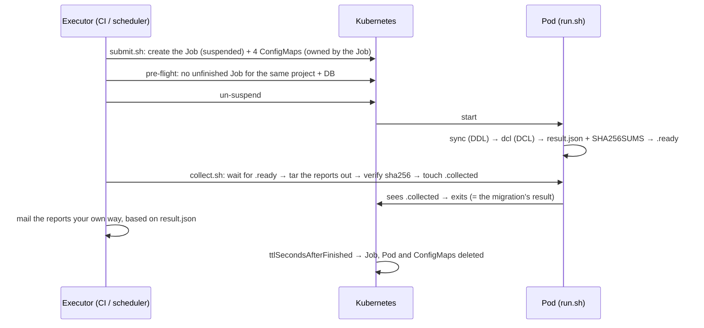

# Dynamic Jobs: DDL + DCL in one run, reports collected from outside

Each deploy creates its own Job (named with a timestamp). In one Pod it runs **DDL (`sync`) first, then DCL (`dcl`)**, and keeps the report HTML in the Pod until an external script collects it; only then does the Pod exit. Sending the email is entirely up to your own system — no mail credentials live in the cluster.

MariaDB (including RDS) and MongoDB use the same template; only the files in the profile directory differ.



---

## 1. Files

| File | Runs | Purpose |
|---|---|---|
| `submit.sh` | outside | Creates and starts one run from a profile directory; always prints the run's name on stdout (whether it started or not) |
| `collect.sh` | outside | Fetches the reports, releases the Pod, returns the run's exit code |
| `run.sh` | in the Pod | DDL → DCL → write the result → wait to be collected (shipped in a ConfigMap by `submit.sh`, so changing it needs no image rebuild) |
| `job.template.yaml` | — | The Job template `submit.sh` fills in; don't apply it by hand |
| `rbac-executor.yaml` | — | Permissions the executor (CI) needs |
| `examples/mariadb/`, `examples/mongodb/` | — | Example profiles — copy one and adapt it |
| `../preflight-check.sh` | outside | Called by `submit.sh`: ConfigMaps exist and aren't empty, the config files are there, no other unfinished Job for the same project + DB |
| `../notification-html.sh` | both | Renders the error email; shared by `submit.sh`, the pre-flight and `run.sh` (also shipped in the config ConfigMap) |

The executor needs `kubectl`, `jq`, `sha256sum`, `tar` and `bash`.

---

## 2. One-time setup

### 2.1 Image

A db-migrate image built from this repo's Dockerfile, **3.0.1 or later** (3.0.0 has no MariaDB TLS support and can mis-report DCL passwords — see `CHANGELOG.md`). `run.sh` calls the image's `/app/docker/entrypoint.sh`, so the "wait until the DB is reachable" step is kept.

### 2.2 Secrets (one per project × DB × DDL/DCL)

The keys are always `username` and `password`. In the Pod they're mounted as `/var/run/secrets/db-migrate/{ddl,dcl}/{username,password}`.

```bash
kubectl -n db-migrate create secret generic db-migrate-shop-mariadb-ddl \
  --from-literal=username=migrator_ddl --from-literal=password='...'
kubectl -n db-migrate create secret generic db-migrate-shop-mariadb-dcl \
  --from-literal=username=migrator_dcl --from-literal=password='...'
```

In production, generate them from your secrets manager (Vault, External Secrets, …) rather than typing them in. **Use separate DB accounts for DDL and DCL:**

| Account | MariaDB privileges | MongoDB roles |
|---|---|---|
| DDL | `CREATE`, `ALTER`, `DROP`, `INDEX`, `SELECT`, `INSERT`, `UPDATE`, `DELETE` on the target schema (the changelog table included) | `dbAdmin` + `readWrite` on the target DB |
| DCL | `CREATE USER`, `GRANT OPTION`, plus every privilege it grants | `userAdmin` on `admin` (or `userAdminAnyDatabase`) |

Neither should be root or a superuser. The table is a recommended minimum; the k3d verification below used root for both Secrets, so run staging once with your real accounts before production.

### 2.3 RBAC for the executor

Set the namespace and subject (your CI's ServiceAccount) in `rbac-executor.yaml` and apply it. `pods/exec` lets its holder open the migration Pod and read the DB credentials mounted there — bind it only to the executor, in this namespace only.

The migration Pod itself needs no API access (the template sets `automountServiceAccountToken: false`).

---

## 3. Profiles

A profile = one DB of one project. Start from an example:

```bash
cp -r k8s/dynamic/examples/mariadb  deploy/shop-mariadb
cp -r k8s/dynamic/examples/mongodb  deploy/shop-mongodb
```

```
deploy/shop-mariadb/
├── profile.env        # parameters for the run
├── db.env             # container env vars: where the DB is (no credentials)
├── ddl.config.js      # required
├── ddl.args           # optional: extra arguments for sync
├── dcl.config.js      # optional: no DCL step without it
├── dcl.args           # optional: extra arguments for dcl
├── *.pem              # optional: TLS CA bundles (e.g. RDS global-bundle.pem), mounted as /app/config/<name>
└── migrations/
    ├── ddl/           # DDL migrations (top level only — subdirectories are refused)
    └── dcl/           # DCL R__ scripts (same)
```

A migrations directory **ships its top-level files only** (a ConfigMap has no subdirectories). If there are files in subdirectories, `submit.sh` refuses the run with an error email instead of silently leaving them out.

### 3.1 `profile.env`

`KEY=VALUE` lines — **no quotes, no trailing comments**. Any key can be overridden by an environment variable of the same name (e.g. `NAMESPACE=production ./submit.sh …`).

| Key | Required | Meaning |
|---|---|---|
| `PROJECT` | ✅ | Lowercase letters, digits and `-`. The Job is named `db-migrate-<PROJECT>-<DB>-<time>-<random>`, at most 63 characters, so PROJECT can be about 20 |
| `DB` | ✅ | `mariadb` or `mongodb` |
| `NAMESPACE` | ✅ | Namespace of the Job and the Secrets |
| `DDL_SECRET` | ✅ | Secret holding the DDL account |
| `DDL_DIR` | ✅ | DDL migrations directory (relative to the profile directory, or absolute) |
| `DCL_SECRET`, `DCL_DIR` | when there's a `dcl.config.js` | The same, for DCL |
| `ENVIRONMENT` | | Shown in the email header, e.g. `production` |

### 3.2 `db.env`: where the DB is, as env vars

```bash
# MariaDB / RDS
MARIADB_HOST=shop.xxxxxxxx.ap-northeast-1.rds.amazonaws.com
MARIADB_PORT=3306
MARIADB_DATABASE=shop
```

```bash
# MongoDB — no credentials in the URL; the config inserts them from the Secret
MONGODB_URL=mongodb://mongo-0.mongo:27017,mongo-1.mongo:27017/?replicaSet=rs0&authSource=admin
MONGODB_DATABASE=shop
```

This file becomes the run's ConfigMap and is injected with `envFrom`. **No passwords in it.**

### 3.3 `ddl.config.js` / `dcl.config.js`

The examples already read credentials from the Secret files and the address from env vars; usually you only change names such as `changelogTable` / `checksumTable`. Notes:

- `migrationsDir` is always `/app/migrations/ddl` and `/app/migrations/dcl` (where the ConfigMaps are mounted).
- `dcl.config.js` must have `mode: 'repeatable'`.
- For MongoDB the credentials are inserted into the URL as a string (not with `new URL()`), so multi-host and `mongodb+srv://` URLs work; they're `encodeURIComponent`-ed, so special characters are fine.
- Long-lived settings (`notifications.keepRuns`, `validation.requireApprover`, `ddlSafety`, …) go here.
- **RDS / any MariaDB that requires TLS**: put AWS's `global-bundle.pem` in the profile directory and add to both configs:

  ```js
  ssl: { caFile: '/app/config/global-bundle.pem' },
  ```

  The server certificate is verified against that CA. Without `ssl` the connection is unencrypted, and a server with `require_secure_transport=ON` refuses it (the error shows up in `ddl/notification.html`). Other forms are in `docs/USER-GUIDE-MARIADB.md` §7.2.

### 3.4 `ddl.args` / `dcl.args`: CLI arguments

**One argument per line**; blank lines and lines starting with `#` are skipped. Values with spaces are fine (the whole line is one argument):

```
--sanity-check
--allow-dangerous
--approved-by
Alice (CAB-1042)
```

- `-c`, `--config`, `-o`, `--output` are set by `run.sh`; putting them in an args file fails the run.
- `dcl` **doesn't validate by default** — keep `--validate` in `dcl.args` (the examples have it).
- Args files live in the profile and are shipped in the run's ConfigMap, so which `--allow-*` each run used, and who approved it, is recorded in git and in the cluster.

| Command | Arguments you can use |
|---|---|
| `sync` (DDL) | `--sanity-check` `--no-auto-rollback` `--target <m>` `--only <m>` `--allow-dangerous` `--allow-forbidden` `--allow <codes>` `--approved-by <name>` `--allow-checksum-drift` `--allow-open-transactions` |
| `dcl` (DCL) | `--validate` `--allow-dangerous` `--allow-forbidden` `--approved-by <name>` `--accept-removed-dcl` |

---

## 4. Running

```bash
export IMAGE=registry.example.com/db-migrate:3.0.1

JOB=$(./k8s/dynamic/submit.sh deploy/shop-mariadb)
rc=$?
if [ $rc -eq 0 ]; then
  ./k8s/dynamic/collect.sh "$JOB" db-migrate
  rc=$?
fi

# hand reports/$JOB/ to your mail delivery (section 5)
your-mailer "reports/$JOB" "$rc"
```

MariaDB and MongoDB are different databases, so they can run in parallel (the pre-flight only blocks overlap on the same project + DB):

```bash
for p in shop-mariadb shop-mongodb; do
  ( JOB=$(./k8s/dynamic/submit.sh deploy/$p) && ./k8s/dynamic/collect.sh "$JOB" db-migrate
    your-mailer "reports/$JOB" $? ) &
done
wait
```

### 4.1 Timeouts and settings

| Variable | For | Default | Meaning |
|---|---|---|---|
| `MIGRATE_TIMEOUT_SECONDS` | submit.sh | 1800 | How long DDL + DCL may take |
| `COLLECT_TIMEOUT_SECONDS` | submit.sh | 3600 | How long the Pod waits to be collected after running; then exit 4 |
| `TTL_SECONDS` | submit.sh | 86400 | How long a finished Job (and its Pod log) is kept |
| `WAIT_SECONDS` | submit.sh | 0 | How long the pre-flight waits for an unfinished run (0 = exit 2 right away) |
| `REPORTS_DIR` | both | `./reports` | Local reports directory; one subdirectory per run, `<REPORTS_DIR>/<JOB>/` |
| `READY_TIMEOUT_SECONDS` | collect.sh | 1800 | How long to wait for `.ready`; match `MIGRATE_TIMEOUT_SECONDS` |
| `FINISH_TIMEOUT_SECONDS` | collect.sh | 120 | How long to wait for the Job to finish after releasing it |
| `SUSPENDED_STALE_SECONDS` | submit.sh (pre-flight) | 600 | A Job suspended this long that never started counts as abandoned and no longer blocks new runs (section 6) |

The Job's `activeDeadlineSeconds` is set to `MIGRATE_TIMEOUT_SECONDS + COLLECT_TIMEOUT_SECONDS`.

### 4.2 Exit codes

**`submit.sh`**

| Code | Meaning | What to do |
|---|---|---|
| 0 | Started | Run `collect.sh` |
| 1 | Bad configuration, or Kubernetes returned an error while creating the Job / ConfigMaps — **nothing ran** | Mail `reports/<run>/notification.html`; it says why (quoting kubectl's error for Kubernetes errors) |
| 2 | Another run for the same project + DB hasn't finished | Transient — retry once it finishes (or set `WAIT_SECONDS`); `notification.html` is written too |

**Started or not, stdout is exactly one line: the run's name**, so `reports/<run>/` can always be found. On failure (exit 1 or 2) `reports/<run>/notification.html` always exists and can be mailed as-is. What gets refused, with an error email:

| Check | Where |
|---|---|
| Profile directory or `profile.env` missing, or a required key missing | submit.sh |
| `ddl.config.js` missing or empty, `db.env` missing | submit.sh |
| DDL migrations directory missing or **empty** | submit.sh |
| `dcl.config.js` present but empty, or the DCL directory missing or **empty** | submit.sh |
| **Files in subdirectories** of a migrations directory (they wouldn't be shipped) | submit.sh |
| A Secret missing | submit.sh |
| Kubernetes error creating the Job / ConfigMaps or un-suspending (e.g. a file name that isn't a valid ConfigMap key, missing permissions) | submit.sh |
| A ConfigMap missing, the migrations ConfigMap **with no files**, the config ConfigMap missing `run.sh` / `notification-html.sh` / `ddl.config.js` / `dcl.config.js` | pre-flight |
| An unfinished run for the same project + DB (a Job with no `db` label, e.g. the older `k8s/job.yaml`, counts for every DB) | pre-flight (exit 2) |

Once the Job exists, **if any step fails or `submit.sh` is interrupted (Ctrl-C / TERM)**, `submit.sh` deletes the Job (its ConfigMaps go with it), so no suspended Job is left behind to block later runs.

**`collect.sh` (= the Pod's exit code)**

| Code | `result.json` | Meaning |
|---|---|---|
| 0 | DDL `applied` or `no-pending`; DCL `changed` / `unchanged` / `not-configured` | Something was applied, nothing failed |
| 1 | DDL or DCL `failed` | Failed (validation refusal, connection failure, bad args, an empty ConfigMap in the Pod). When DDL fails, DCL doesn't run (`not-run`) |
| 3 | DDL `no-pending` and DCL not `changed` | Nothing to do. Treated as a failure, like `sync`, so a pipeline doesn't mistake "did nothing" for success |
| 4 | — | Not collected within `COLLECT_TIMEOUT_SECONDS` (collect.sh never returns this — it returns 10 first) |
| 10 | if `reports/<JOB>/result.json` exists, it has the real result | collect.sh itself failed: the Pod already ended, `.ready` timed out, checksum mismatch, a kubectl error releasing the Pod or reading its result, the Job disappeared or didn't finish within `FINISH_TIMEOUT_SECONDS`. **Doesn't mean the migration failed** — if the reports were fetched, `result.json` says how it went |

Job status: exit 0 → `Complete`, anything else → `Failed`.

---

## 5. Collected files and mail

`reports/<JOB>/` (directory mode 700):

| File | When | Send to |
|---|---|---|
| `result.json` | always | Don't send — **use it to decide what happened** |
| `ddl/notification.html` | **always**: db-migrate's own report, or an error email from run.sh (below) | DDL recipients, as the body |
| `ddl/sync-report-<time>.html` | when sync reached the apply step (applied, apply failed, or nothing pending) | DDL recipients, as an attachment: full schema diff + current schema |
| `ddl/sync-report-<time>.json` | same | for tooling |
| `dcl/notification.html` | when DCL ran an account script, failed, or skipped a script | **Restricted recipients only** — may contain **plaintext passwords** of new accounts |
| `notification-<runId>.html` | same content as the `notification.html` next to it | Don't send (db-migrate's per-run copy) |

`result.json` example:

```json
{
  "environment": "production",
  "ddl": { "status": "applied", "rc": 0 },
  "dcl": { "status": "changed", "rc": 0 },
  "rc": 0
}
```

| `ddl.status` | `dcl.status` |
|---|---|
| `applied` / `no-pending` / `failed` | `changed` / `unchanged` / `failed` / `not-run` (DDL failed) / `not-configured` (profile has no DCL) |

### How DCL reports existing and new accounts

A DCL script runs only when its content changed. When it runs, each account shows up under "Account changes" in `dcl/notification.html`:

| Shown | Meaning | Password? |
|---|---|---|
| `NEW` | Account created in this run | ✅ the generated one, when the script uses `CHANGE_ME_ON_FIRST_LOGIN` (not shown for hard-coded passwords) |
| `NO CHANGE` — *Account already existed - password unchanged.* | Account already existed; password untouched | — |
| `PASSWORD CHANGED` | Password reset on an existing account | ✅ |
| `PERMISSIONS UPDATED` | Grants changed on an existing account | — (grants added / removed listed) |
| `REMOVED` | Account dropped, or all its grants revoked | — |

How it's decided:

- **MariaDB, `CREATE USER … IDENTIFIED BY 'CHANGE_ME_ON_FIRST_LOGIN'`**: before running the file, db-migrate looks up each `'user'@'host'` in `mysql.user`. Already there → `NO CHANGE`; not there → `NEW` with its password.
  - Several accounts in one `CREATE USER` (`'a'@'%' IDENTIFIED BY '…', 'b'@'%' IDENTIFIED BY '…'`) and accounts without `@host` (treated as `'%'`) work; each gets its own password.
  - `CREATE OR REPLACE USER`, or `DROP USER` followed by `CREATE USER` in the same file: an account that already existed shows `PASSWORD CHANGED` with the new password (not `NO CHANGE`).
  - `ALTER USER` / `SET PASSWORD FOR` → `PASSWORD CHANGED`.
  - A placeholder in a statement whose account can't be recognized (e.g. old-style `GRANT … IDENTIFIED BY`): its password is still in the email, labeled `(unrecognized account, statement N)` — never lost, and the following accounts' passwords don't shift.
- **MariaDB, hard-coded passwords**: no lookup beforehand; the account list before and after the run is compared. New accounts show `NEW` (no password); accounts that already existed with unchanged grants **don't appear**.
- **MongoDB**: the script checks `usersInfo` itself and returns `{ passwordSet, createdUsernames, allUsernames }` so db-migrate knows which accounts are new (the example `examples/mongodb/migrations/dcl/R__001_app_accounts.js` does this); each account is reported on its own. `allUsernames` must list **every** account that uses `CHANGE_ME_ON_FIRST_LOGIN`, in file order — passwords are paired in that order. **A Mongo script that doesn't return this object can't be reported correctly.**

New and existing accounts can share one R__ file: each account is judged on its own — existing ones `NO CHANGE`, new ones `NEW` with their own password.

If a Mongo script doesn't return `allUsernames`, or its count doesn't match the number of placeholders, db-migrate can't tell which password belongs to which account and **doesn't guess**: the email shows the account as created, says its password couldn't be matched, and asks for the account to be rotated.

Notes:

- When db-migrate can't write its report, `run.sh` writes an error email in its place — so the mail step can simply send any `notification.html` that exists. Cases (all checked **before anything runs**; a broken DCL setup stops DDL from running too):
  - DDL migrations ConfigMap empty in the Pod, `ddl.config.js` missing or empty → `ddl/notification.html`
  - `dcl.config.js` empty, or the DCL ConfigMap empty → `dcl/notification.html`, plus `ddl/notification.html` saying DDL didn't run because of it
  - `-c` / `-o` in an args file → that step's `notification.html`
  - `entrypoint.sh` can't reach the DB (about 60 s) → "DDL did not run", **quoting the actual error** (TLS refused, certificate verification failed, wrong password, …) and the `kubectl logs` command
- The DCL email is the only place its passwords exist. Delete your local copy once it's delivered, per your policy, and don't let the mailer log the message body.
- Collection uses `kubectl exec … tar`. The report files are mode `0600`, owned by uid 1000 — the Pod's own user — so they're readable that way.

---

## 6. Troubleshooting

| Situation | What to do |
|---|---|
| `collect.sh` returned 10 but the Pod is still waiting | Run `collect.sh <JOB> <ns>` again — possible any time within `COLLECT_TIMEOUT_SECONDS` |
| Pod exited 4 (reports never collected) | The reports are gone. If DCL was `changed`, the passwords generated in that run **can't be recovered**, though the accounts exist: rotate them with an `ALTER USER` (MariaDB) or `updateUser` (MongoDB) R__ script and run again (see `docs/DCL-PASSWORD.md`) |
| DDL `failed` | The failing migration may be **partly applied** (MariaDB commits each DDL statement). Read `ddl/notification.html` and the log, check the database by hand, fix the migration and submit again. **Don't** raise `backoffLimit` |
| `submit.sh` returned 2 | Another run is going (or waiting to be collected). Find it with `kubectl -n <ns> get jobs -l app=db-migrate,project=<p>`; wait for it or delete it |
| Pre-flight prints "Ignoring Job(s) suspended for over …" | A `submit.sh` died between creating its Job and starting it (e.g. the CI runner was killed), leaving a Job suspended forever. It no longer blocks new runs; the message includes the delete command — remove it when convenient (its ConfigMaps go with it) |
| The Pod never starts (image pull failure, …) | `collect.sh` returns 10 after `READY_TIMEOUT_SECONDS`; see `kubectl describe pod -l job-name=<JOB>`, fix it, delete the Job and submit again |
| Logs | `kubectl -n <ns> logs job/<JOB>`, kept for `TTL_SECONDS` (one day by default) |

---

## 7. Known limitations

- **RDS privileges not verified**: the runtime gates read `information_schema.PROCESSLIST` and InnoDB transaction info; on RDS the DDL account may need `PROCESS` to see other sessions' long transactions.
- This flow is separate from the deploy jobs in `.github/workflows/migrations.yml` (`k8s/job.yaml`, DDL only); CI doesn't use it yet.

---

## 8. Verification (k3d, 2026-10-06)

Run on a local k3d cluster (MariaDB 11, MongoDB 7 with auth, a Mongo password containing `@ : /`); every result matched the tables above:

| Scenario | Result |
|---|---|
| MariaDB first run: 2 DDL migrations + DCL creating 2 accounts | exit 0; the DCL email has the passwords and they log in; no password in the Pod log |
| MariaDB run again with nothing changed | exit 3 |
| MariaDB with only DCL changed | DDL `no-pending`, DCL `changed`, exit 0 |
| MariaDB with a broken DDL migration | DDL `failed`, DCL `not-run`, exit 1, `ddl/notification.html` explains the failure |
| MongoDB first run / run again | exit 0 / exit 3; the DCL email has the passwords. The first attempt's DCL failed because the image's `/tmp` was root-owned 755 (`EACCES … mkdtemp`); passed once the template mounted an emptyDir at `/tmp` (the Dockerfile now sets `1777` too) |
| No collect.sh (`COLLECT_TIMEOUT_SECONDS=25`) | Pod exit 4; after `TTL_SECONDS` the Job, Pod and all 4 ConfigMaps were gone |
| Submit again while a run waits to be collected | pre-flight exit 2; the new Job and its ConfigMaps deleted; notification.html written |
| `ddl.args` with `--approved-by` + `Alice (CAB-1042)` | value reached sync intact |
| `-o` in `ddl.args` | refused, exit 1 |
| DCL script changed while its accounts exist (MariaDB, MongoDB) | DCL `changed`; both accounts `NO CHANGE — Account already existed - password unchanged.` |
| A new `CHANGE_ME` account added to an R__ file whose accounts exist (MariaDB, MongoDB) | Before the fix: MariaDB showed the new account as `NO CHANGE` and its password was lost; MongoDB's emailed password was wrong (login failed). After: existing accounts `NO CHANGE`, the new one `NEW`, emailed password logs in |
| submit: no `ddl.config.js`, empty DDL directory, empty DCL directory | exit 1, run name on stdout, `reports/<run>/notification.html` (0600) says why, no Job created |
| pre-flight: migrations ConfigMap with no files, config ConfigMap missing a key | exit 1, both problems listed in the email |
| In the Pod (run.sh run directly with docker): empty DDL ConfigMap, empty DCL ConfigMap, `--output` in args, DB unreachable | each writes its error `notification.html`; with an empty DCL ConfigMap DDL didn't run either |
| ConfigMap creation fails (file name with a space — not a valid key) | exit 1, email quotes kubectl's error; the suspended Job deleted, nothing left behind |
| Un-suspend (`kubectl patch`) fails | exit 1, same |
| Migrations only in a subdirectory | exit 1, email lists the files |
| A suspended Job left behind: younger / older than `SUSPENDED_STALE_SECONDS` | blocks (exit 2) / warning with the delete command, new run proceeds |
| A running Job with no `db` label (older `k8s/job.yaml` style) | both MariaDB and MongoDB submits blocked (exit 2); a Job labeled `db=mongodb` doesn't block MariaDB |
| collect: releasing the Pod fails / Job deleted after release | exit 10 (not 1), reports already saved; in the first case the Pod later exits 4 |
| MariaDB with `require_secure_transport=ON` (self-signed CA): no `ssl` / wrong CA / correct `ssl: { caFile }` | first two exit 1, the email quotes the real error (insecure transport prohibited / self-signed certificate in chain); correct CA → DDL + DCL succeed |
| Two accounts in one `CREATE USER`, and one account without `@host` | all three `NEW`, each logs in with its emailed password |
| `CREATE OR REPLACE USER` on an existing account | `PASSWORD CHANGED`; the emailed new password logs in, the old one doesn't |
